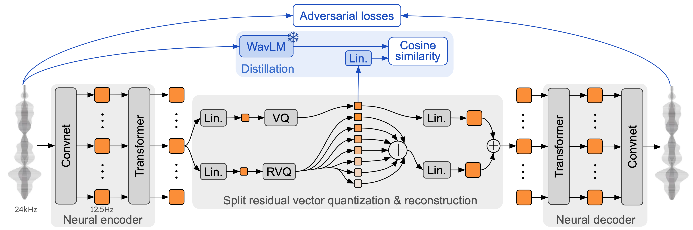

# Moshi - Mini

This is the PyTorch implementation for Mimi.

## Introduction

<p align="center">
</p>

Mimi builds on previous neural audio codecs such as [SoundStream](https://arxiv.org/abs/2107.03312)
and [EnCodec](https://github.com/facebookresearch/encodec), adding a Transformer both in the encoder and decoder,
and adapting the strides to match an overall frame rate of 12.5 Hz. This allows Mimi to get closer to the
average frame rate of text tokens (~3-4 Hz), and limit the number of autoregressive steps in Moshi.
Similarly to SpeechTokenizer, Mimi uses a distillation loss so that the first codebook tokens match
a self-supervised representation from [WavLM](https://arxiv.org/abs/2110.13900), which allows modeling semantic and acoustic information with a single model. Interestingly, while Mimi is fully causal and streaming, it learns to match sufficiently well the non-causal
representation from WavLM, without introducing any delays. Finally, and similarly to [EBEN](https://arxiv.org/pdf/2210.14090),
Mimi uses **only an adversarial training loss**, along with feature matching, showing strong improvements in terms of
subjective quality despite its low bitrate.

## Installation

```bash
cd tokenizer/audio/moshi_mimi
pip install -e .
```

## Usage

```python
from audiotools import AudioSignal
from mimi.model import MimiTokenizer

def inference_mimi(wav_file, outfile):
    """
    Moshi
    """
    print("---------------------------")
    print("Inference audio by Moshi model...")
    signal = AudioSignal(wav_file)
    signal.to("cuda")
    mimi = MimiTokenizer.load_from_checkpoint(
        cpt_dir=xxx,
        "cuda"
    )

    # inference
    print("singal duration:", signal.signal_duration)
    with torch.no_grad():
        codes = mimi.encode(signal.audio_data)
        audio_hat = mimi.decode(codes)
    y = AudioSignal(audio_hat, signal.sample_rate)
    y.to("cpu")

    print("model sample rate:", mimi.sample_rate, "signal sample rate:", signal.sample_rate, "frame_rate: ", mimi.frame_rate, "frame size:", int(mimi.sample_rate / mimi.frame_rate))
    for n_layer, code in enumerate(codes):
        print("quant layer:", n_layer, "code shape:", code.shape)
    print("input shape:", signal.audio_data.shape, "recons shape:", y.audio_data.shape)

    # Write to file
    y.write(outfile)
```
